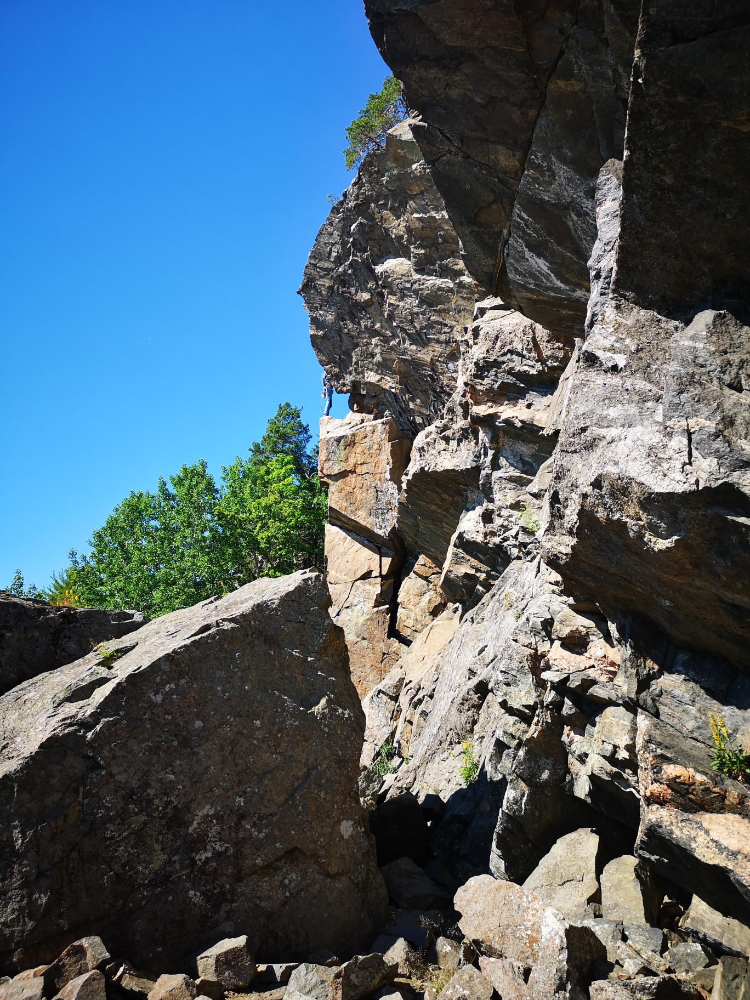
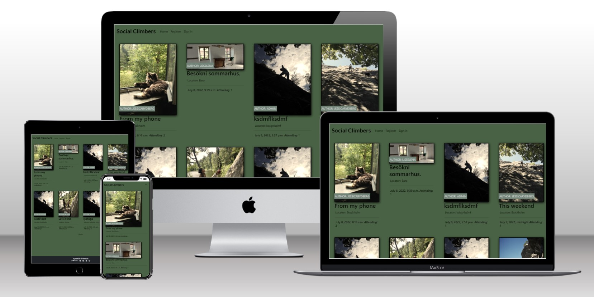

# Social Climbing

Welcome to my page Social Climbing. This is a website that gives climbers a way to socialise and plan events together.
This is my 4:th project for my portfolio through Code Institutes course Fullstack Developer. [Read more](http://codeinstitute.com)

On Social climbing you can view all upcoming events and if you register as a user you can log in and create your own events. While logged in you can also attend others events and comment on them.

[View live project here](https://social-climbing.herokuapp.com/)

# User experience UX

## User Stories
 - As a Administrator I can create events so that I can get people together for planning an event
 - As a user I can pick my own image for my event so that I can reach out with a unique event post
 - As a User I can receive messages telling me I submitted successfully so that be sure that my action was successfull
 - As a Administrator I can update and delete events so that I can provide new information if something changes
 - As a User I can see only events that are in the future so that I can focus on the events that are relevent
 - As a User I can pick a date and time for my event so that I can make it more easy than writing
 - As a Site User I can create events so that I can get people together and plan events
 - As a User I can click on attned so that I can attend the event I am interested in
 - As a User I can edit my events so that change information if needed
 - As a User I can delete events I made so that remove it from other users if I cant attend anymore
 - As a Site User I can create a User so that I can log in and out
 - As a Site User/Admin I can comment on events so that I can ask and answer questions about the event
 - As a Administrator I can approve comments so that I can filter out unnecessary comments
 - As a Site User/Admin I can log in and out so that I can create, attend and comment events
 - As a Site User I can view a list of events so that I can see if anything is interesting to me
 - As a Administrator I can view how many who clicked on attend so that get information about number of participants
 - As a Site User I can click on a event so that get more information about the event

 ## Agile Methodology
 - I used Github for planning and working through this project. Please find my project on GitHub [here](https://github.com/jessicarydberg/SocialClimbing/projects/1)

 