# Social Climbing

Welcome to my page Social Climbing. This is a website that gives climbers a way to socialise and plan events together.
This is my 4:th project for my portfolio through Code Institutes course Fullstack Developer. [Read more](http://codeinstitute.com)

On Social climbing you can view all upcoming events and if you register as a user you can log in and create your own events. While logged in you can also attend others events and comment on them.

[View live project here](https://social-climbing.herokuapp.com/)

# User experience UX

## User Stories
 - As a Administrator I can create events so that I can get people together for planning an event
 - As a user I can pick my own image for my event so that I can reach out with a unique event post
 - As a User I can receive messages telling me I submitted successfully so that be sure that my action was successfull
 - As a Administrator I can update and delete events so that I can provide new information if something changes
 - As a User I can see only events that are in the future so that I can focus on the events that are relevent
 - As a User I can pick a date and time for my event so that I can make it more easy than writing
 - As a Site User I can create events so that I can get people together and plan events
 - As a User I can click on attned so that I can attend the event I am interested in
 - As a User I can edit my events so that change information if needed
 - As a User I can delete events I made so that remove it from other users if I cant attend anymore
 - As a Site User I can create a User so that I can log in and out
 - As a Site User/Admin I can comment on events so that I can ask and answer questions about the event
 - As a Administrator I can approve comments so that I can filter out unnecessary comments
 - As a Site User/Admin I can log in and out so that I can create, attend and comment events
 - As a Site User I can view a list of events so that I can see if anything is interesting to me
 - As a Administrator I can view how many who clicked on attend so that get information about number of participants
 - As a Site User I can click on a event so that get more information about the event

 ## Agile Methodology
 - I used Github for planning and working through this project. Please find my project on GitHub [here](https://github.com/jessicarydberg/SocialClimbing/projects/1)

 #Features

 ## Home page
 The home page is what the user sees when first entering the site. Here it is possible to view all events that have the event date set to todays date or further in the future. The old events will automatically be filtered out.

 At this page you can click on different links to get you further to other pages.

 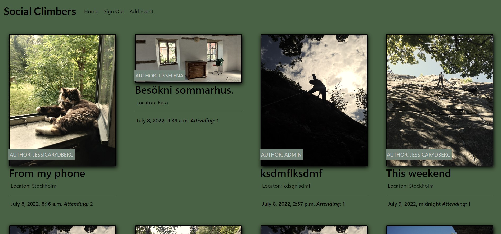

 ### Paginate on home page
 If there are more than 8 events on the home page it will be paginated and arrows will show up at the bottom of the page the get you to the rest of the events.

 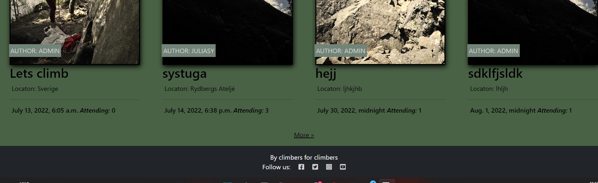

 ## Admin page
 The admin page is reached by adding /admin to the end of the site url. This site is only reachable by the administrator.
 
 At this page the administrator can create events and comments, edit and delete it. It is also possible to search on events and comments and filter out the ones that are interesting

 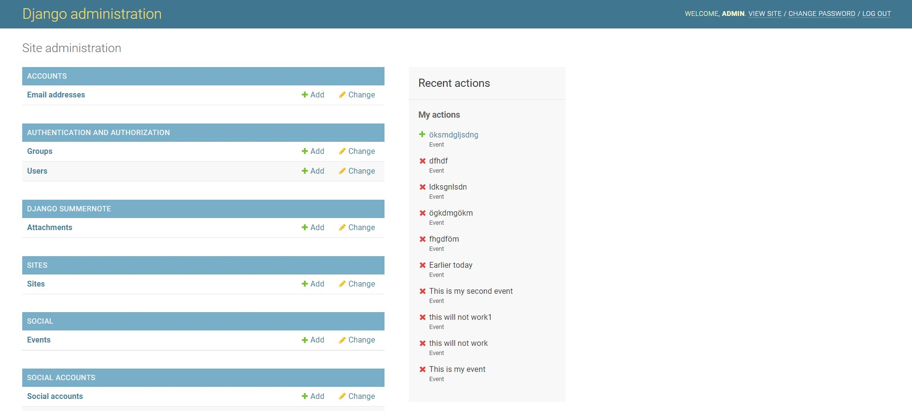

 ## Event page
 This page is reached from home page by clicking on an event, either on the title or on the image.

 Here it is possible to get more information about the event. Information on this page that is not on the home page is the content of the event and comments made. If the user is logged in it is also possible here to attend the event and leave comments. If the user is the author of the event it is also possible to delete and edit the event

 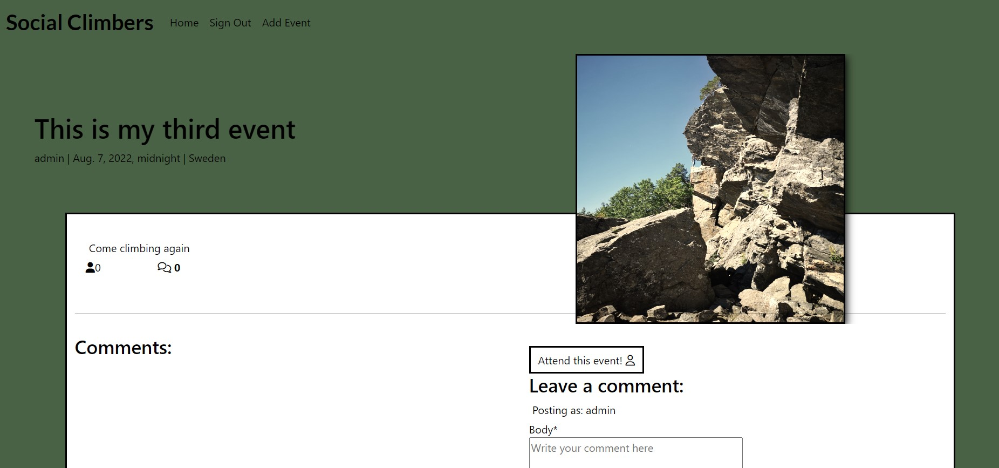

 ## Register user
 At the top of the home page navigation bar the user can click on "Register" and reach this page. Enter username and password to create a user.
 
 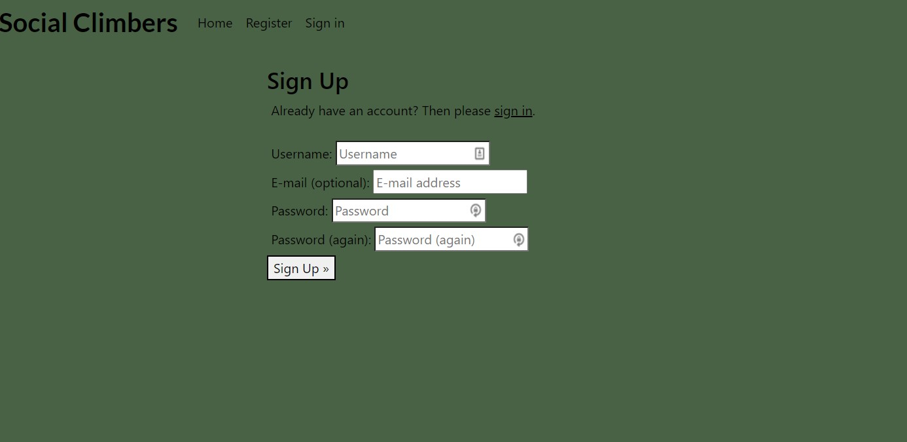

 ## Sign in
At the top of the home page navigation bar the user can click on "Sign in" and reach this page. If you have created a user this is where you login.

 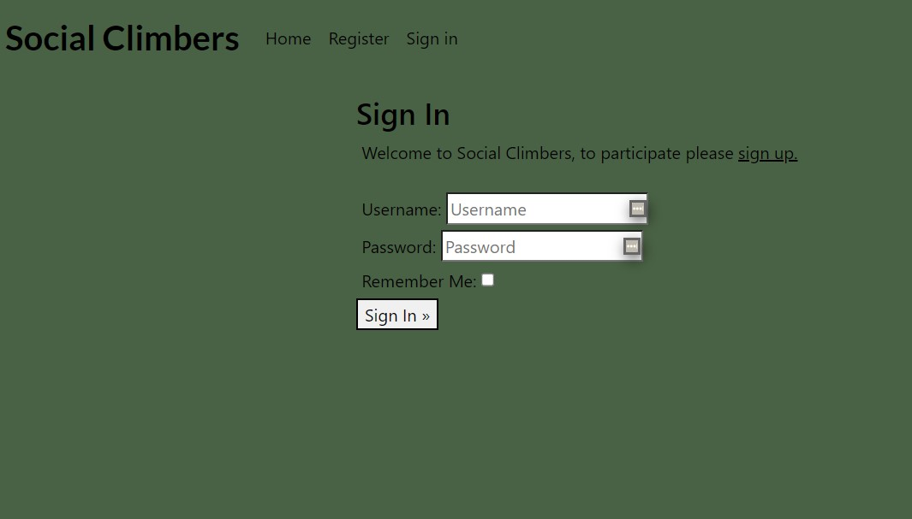

 ## Sign out
If the user is loged in then the "Sign out" link will show at the top of the home page navigation bar. This is where you Sign out.

 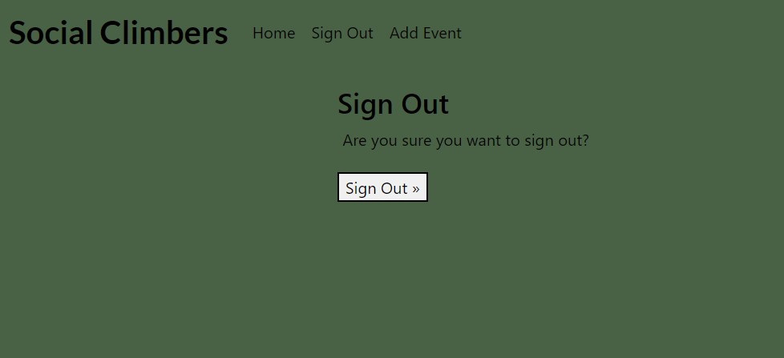

 ## Add event
 If the user is loged in the link "Add event" will show at the top of the home page navigation bar. If this link is clicked then this page is reached.

 Here the logged in user will reach a form where they can add an event. The form will not be valid if the title, date, location and content isnt filled in. The date field must be in the right format and to help the user they will be provided a date and time picker. At the bottom the user can add a custom image for the event. If they dont choose an image a default image will be provided.

 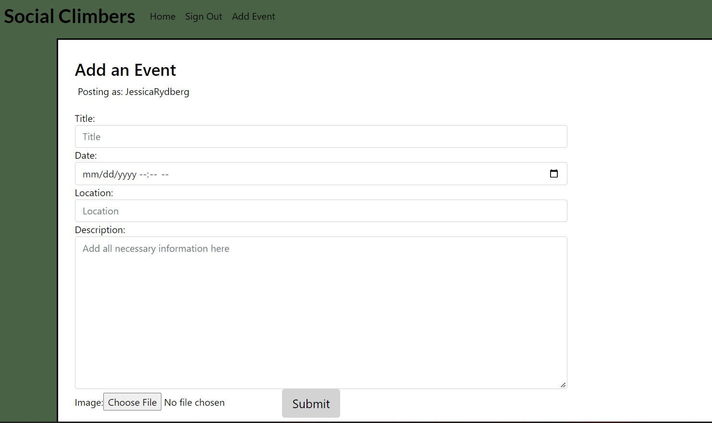

 ## Attend event
 For the logged in user at the event page it is possible to attend the event clicking on the button "Attend this event!". It is also possible to click again to not attend.

 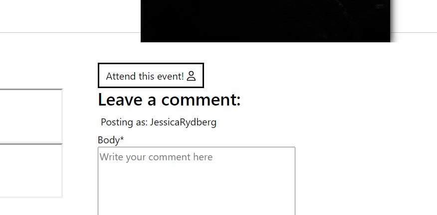

 ## Comment event
 For the logged in user at the event page it is possible to comment at the event using the form provided.

 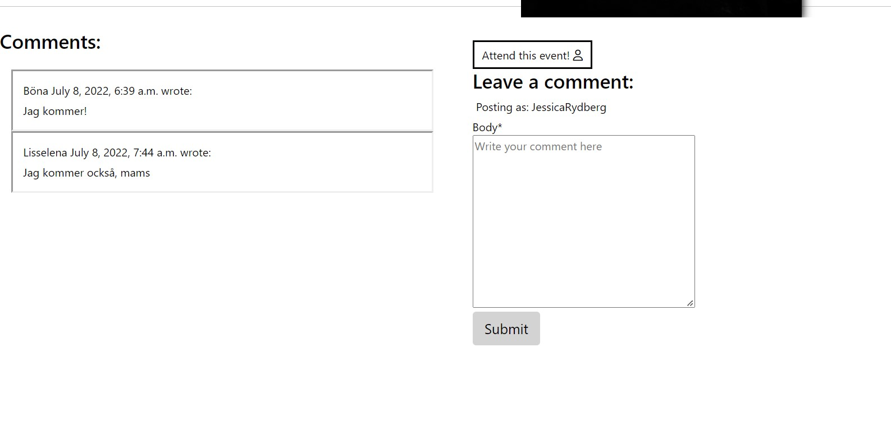

 ## Edit and delete event
 At the event page it is possible to edit and delete event if the user is the same as the author of the displayed event. Clicking the edit button will get you to a form where you can edit the event. Clicking the delete button will get you to a page that warns you and asks you if you are sure you want to delete and then you need to click on delete again.

 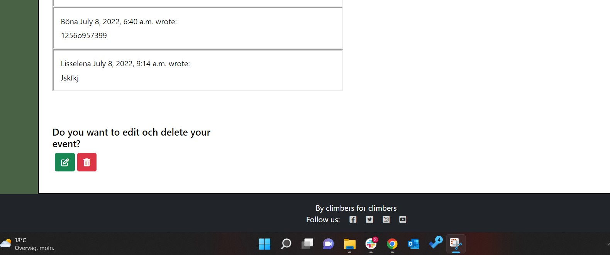
 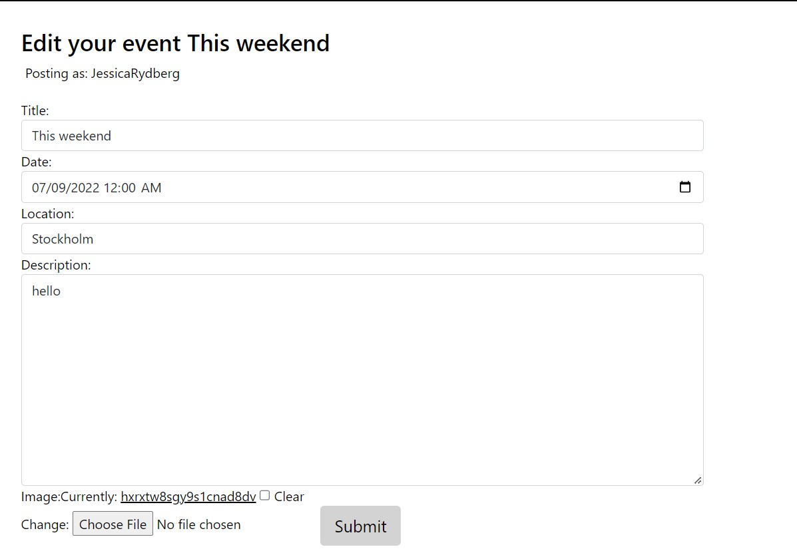
 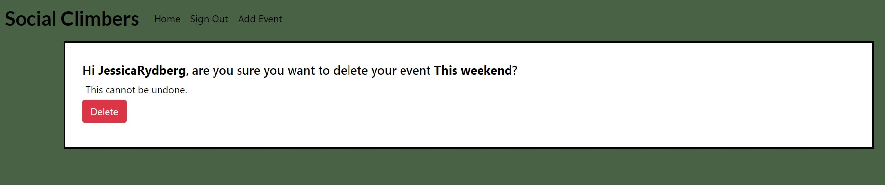